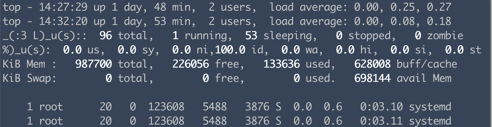

巷では、コンピュータを使って「年収を如何に上げるか」とか「すごい存在になるためにはどうしたらいいか」が流行っている様だけれど、
私には、この社会のつまらない感覚をブチ破ってくれる、サスティナブルな熱狂をください。

という気分でパラパラを本を読んでいたら、Binaryの世界が目に止まった。

- [Binary Hacks](https://www.amazon.co.jp/dp/4873112885/)
- [普通のやつらの下を行け: ptrace で実行中のプロセスにちょっかいを出す](http://0xcc.net/blog/archives/000077.html)
- [livepatch - Live Patching for Linux](http://ukai.jp/Software/livepatch/)

私はほら、BigDataにときめくのが本職（現職はまた異なる）で、低レイヤーは別にそんなに興味あるわけじゃないんだからね！なのだけれど、沼感が良くて最近低レイヤーに入門しそう。

[ptrace(2)](https://man7.org/linux/man-pages/man2/ptrace.2.html)というシステムコールを使うと、なんと実行中の他プロセスのレジスタの書き換えやメモリ上のデータ書き換えが出来るらしく、デバッガで使われているとのこと。面白そう〜🌟

多分知っている人は[知っている](https://twitter.com/search?q=ptrace%20lang%3Aja&src=typed_query)のかな？

上のbkブログさんのコードとほぼ変わらないのだけど、こんな感じのコードを作って、ブログの通りにやる。

```c
#include <stdio.h>
#include <errno.h>
#include <assert.h>
#include <sys/ptrace.h>
#include <sys/types.h>
#include <sys/wait.h>
#include <stdlib.h>

int
main (int argc, char **argv)
{
    assert(argc == 4);
    pid_t pid = atoi(argv[1]);
    void *addr = (void *)strtol(argv[2], NULL, 0);
    void *word = (void *)strtol(argv[3], NULL, 0);

    ptrace(PTRACE_ATTACH, pid, NULL, NULL);
    perror("ATTACH");
    wait(NULL);
    ptrace(PTRACE_POKEDATA, pid, addr, word);
    perror("POKEDATA");
    ptrace(PTRACE_DETACH, pid, NULL, NULL);
    perror("DETACH");
    return 0;
}
```

[perror(3)](https://man7.org/linux/man-pages/man3/perror.3.html)は前職の人々が教えてくれた。

```c
#include <stdio.h>
int
main ()
{
    while (1) {
        printf("hello, world\n");
    }
    return 0;
}
```

```
$ gcc -o poke poke.c
$ gcc -o hello hello.c
$ objdump -s hello | grep -C1 hello

hello:     file format elf64-littleaarch64

--
Contents of section .rodata:
 0820 01000200 00000000 68656c6c 6f2c2077  ........hello, w
 0830 6f726c64 00                          orld.

=> hの位置は0820から8個先なので、アドレスは0x0828か？（後に解決）

$ ./hello => 別シェルで起動
$ ps aux | grep hello
root       940 45.6  0.0   1924   416 pts/1    S+   11:17   0:01 ./hello
=> 対象のプロセス番号は940番であることを確認

[Docker on M1Mac]
$ ./poke 940 0x0828 0x285f333a
attach: Operation not permitted
poke: No such process
dettach: No such process

[ Ubuntu 21.なんとか ]
$ ./poke <プロセス番号> <開始位置> <書き換えたい文字列>
ATTACH: Success
POKEDATA: Input/output error
DETACH: Input/output error

```

## できない
上記のように手元にあったDocker on M1MacのUbuntuイメージとUbuntuのマシンでやってみたら実行に失敗したが、どうもEC2(Amazon Linux2)で実行すると上手くいくらしい。何の差？と、しばらくトライしたら解決した。

まず、Docker環境の`Operation not permitted`のエラーは`docker run`実行時に`--cap-add=ALL`を付けると無くなった。前職の人が教えてくれた。

- [Docker run reference](https://docs.docker.com/engine/reference/run/)

Linux capabilitiesというものを知る。root権限ってガチで無敵らしい。
- [capability.h](https://github.com/torvalds/linux/blob/124ea650d3072b005457faed69909221c2905a1f/include/uapi/linux/capability.h)
- [capabilities(7)](https://man7.org/linux/man-pages/man7/capabilities.7.html)

次に、Ubuntuで実行出来なかったのは、**アドレスが動的リンク時のアドレス**になっているからだった。

「開始位置を決めるのはリンカの仕事」と教えてもらったのがヒントになった。
gccでコンパイルするときに`--static`を付けると静的リンクのアドレス(0x455968)が表示されるので、このアドレスに対して実行したら書き換えることができた。

```
$ objdump -s hello | grep -C1 hello

hello:     file format elf64-littleaarch64

--
Contents of section .rodata:
 0820 01000200 00000000 68656c6c 6f2c2077  ........hello, w
 0830 6f726c64 00                          orld.

$ gcc -o hello hello.c --static
$ objdump -s hello | grep -C1 hello

hello:     file format elf64-littleaarch64

--
 455960 60434500 00000000 68656c6c 6f2c2077  `CE.....hello, w
 455970 6f726c64 00000000 2e2e2f63 73752f6c  orld....../csu/l
```

## できたけど
えっじゃあ、Amazon Linux2のgccまたはリンカは`--static`つけなくても静的リンクしているってこと？と思いかけたけれど、lddの結果は明らかに動的リンクに見えるよね。
初心者で調査手段もあまりよくわかっていない感じがある。

```
[Amazon Linux2]
$ gcc -o hello hello.c
$ ldd hello => 
	linux-vdso.so.1 (0x00007fff8ebe5000)
	libc.so.6 => /lib64/libc.so.6 (0x00007f16a9d95000)
	/lib64/ld-linux-x86-64.so.2 (0x00007f16aa140000)

[Ubuntu on Docker]
[動的リンク]
$ gcc -o hello hello.c
$ ldd hello
	linux-vdso.so.1 (0x0000ffff9fc13000)
	libc.so.6 => /lib/aarch64-linux-gnu/libc.so.6 (0x0000ffff9fa5e000)
	/lib/ld-linux-aarch64.so.1 (0x0000ffff9fbe3000)
$ size hello
   text	   data	    bss	    dec	    hex	filename
   1795	    656	      8	   2459	    99b	hello

[静的リンク]
$ gcc -o hello hello.c --static
$ ldd hello
	not a dynamic executable
$ size hello
   text	   data	    bss	    dec	    hex	filename
 495626	  20428	   5688	 521742	  7f60e	hello

ファイルサイズ結構違うね👀
```

## topコマンドに潜むたかざわじゅんすけ
とにかくtopコマンドの表示にたかざわじゅんすけ_(:3」∠)_を忍ばせてみる。

```
[たかじゅんの16進数表記]
$ echo -n '_(:3 L)_' | od -x
0000000      285f    333a    4c20    5f29

$ objdump -s `which top` | grep -C1 Tasks
 413ee0 004d6942 00476942 00546942 00506942  .MiB.GiB.TiB.PiB
 413ef0 00456942 00546173 6b730043 70752873  .EiB.Tasks.Cpu(s　<-こっち？
 413f00 293a0043 7075252d 33643a00 616e6f74  ):.Cpu%-3d:.anot
--
 415a40 75736572 732c2020 6c6f6164 20617665  users,  load ave
 415a50 72616765 3a0a2020 20546173 6b733a7e  rage:.   Tasks:~
 415a60 33202036 34207e32 746f7461 6c2c7e33  3  64 ~2total,~3

$ ./poke 6764 0x0413ef5 0x5f294c20333a285f <- リトルエンディアン
ATTACH: Success
POKEDATA: Success
DETACH: Success

$ top
top - 14:27:29 up 1 day, 48 min,  2 users,  load average: 0.00, 0.25, 0.27
top - 14:39:00 up 1 day,  1:00,  2 users,  load average: 0.00, 0.01, 0.10
_(:3 L)_u(s)::  95 total,   1 running,  52 sleeping,   0 stopped,   0 zombie

いる

[一つのアドレスから8bit以上差し込めないの図]
$ ./poke 6764 0x0413ef5 0x005f29204c20333a285f
ATTACH: Numerical result out of range
POKEDATA: Numerical result out of range
DETACH: Numerical result out of range
→アドレス番号を+8して8bit書き込めば良いみたい。
```



バイナリの世界であれば、言語に依らず、プロプライエタリだろうと関係なく、好き勝手が出来る自由があるんだね。
あと、プロセスのイメージを少し勘違いしていたかもしれない。思ったより柔軟。


## そういえば
才知溢れる（笑）大学生の時分に、妙なSF小説が思い浮かんで[「たかざわじゅんすけは考えた_(:3」∠)_」](https://kakuyomu.jp/works/1177354054881962311)を執筆した。

大学四年生の当時の理解は正しいかはさておき、教授へのメールの文章に紛れ込んでしまったたかざわじゅんすけ_(:3」∠)_が、自らのバイナリを書き換えることを思案するという内容がある。

当時はptraceのことを知らなかったのだけど、自プロセスの書き換えでも.rodataセクションに置かれた定数を書き換える場合、ptraceを発行する必要がありそうだよね？

残念ながら、ストーリーとしては既にケーブル上を走っている間の出来事なので、魔法の力の話でした。5年経った今になって自分の作品について思考できる、嬉しい。

## リンク
- [ptraceシステムコール入門 ― プロセスの出力を覗き見してみよう！](https://itchyny.hatenablog.com/entry/2017/07/31/090000)
- [GNU ldで一部をスタティックリンクにする](https://fukasawah.github.io/posts/2019/01/07/a-part-static-link-in-gnu-ld/)
- [プロセス、実行形式、リンク 筑波大学 情報科学類 オペレーティングシステム II](http://www.coins.tsukuba.ac.jp/~yas/classes/os2-2009/2009-12-01/index.html)